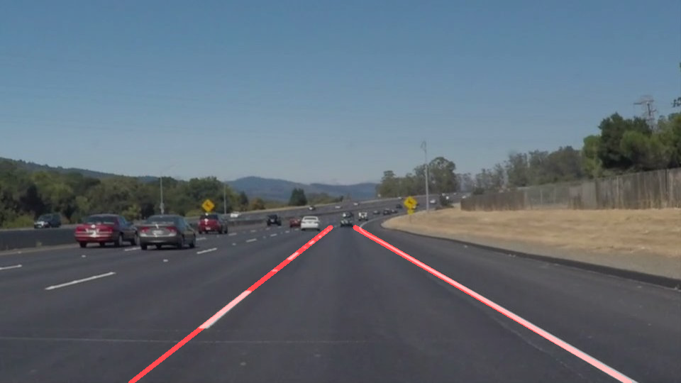

# **Finding Lane Lines on the Road** 

## Udacity Self-Driving Car Engieer Nano Degree Project1
---

**Finding Lane Lines on the Road**

The goals / steps of this project are the following:
* Make a pipeline that finds lane lines on the road
  Canny edge detector, Guassian smoothing and Hough line transform and other techniques learned from Lesson1 are used to find lane lines in the test images/videos.
* Reflect on your work in a written report
  Shortcomings are listed with future improvements discussed.
  
---

**Quick Example**

Original Image:

Image with Lanes:

---

### Reflection

### 1. Describe your pipeline. As part of the description, explain how you modified the draw_lines() function.

My pipeline consisted of 5 steps. First, I converted the images to grayscale, then I .... 

In order to draw a single line on the left and right lanes, I modified the draw_lines() function by ...

If you'd like to include images to show how the pipeline works, here is how to include an image: 

![alt text][image1]

### 2. Identify potential shortcomings with your current pipeline

One potential shortcoming would be what would happen when ... 

Another shortcoming could be ...

### 3. Suggest possible improvements to your pipeline

A possible improvement would be to ...

Another potential improvement could be to ...
